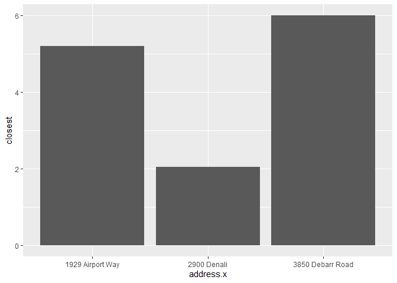
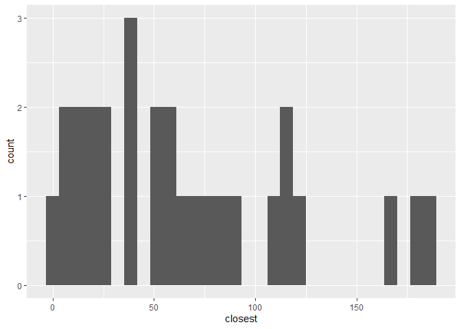
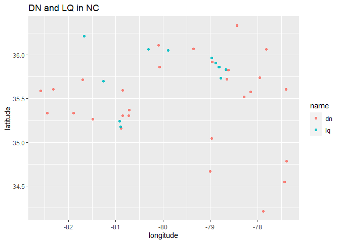
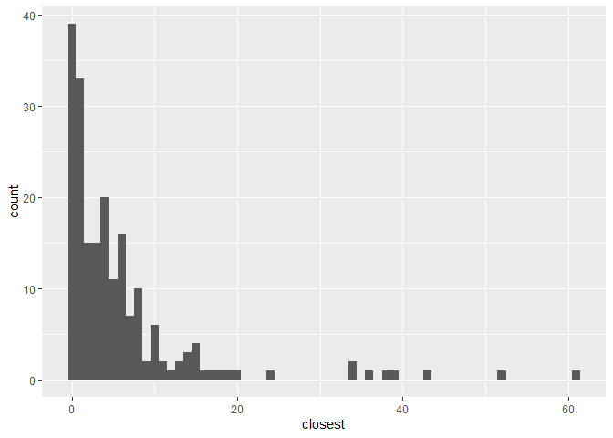

Lab 04 - La Quinta is Spanish for next to Denny’s, Pt. 2
================
Insert your name here
Insert date here

### Load packages and data

``` r
library(tidyverse) 
library(dsbox) 
```

``` r
states <- read_csv("data/states.csv")
```

### Exercise 1

``` r
#1
dn<-dennys
lq<-laquinta

str(dn)
```

    ## spec_tbl_df [1,643 x 6] (S3: spec_tbl_df/tbl_df/tbl/data.frame)
    ##  $ address  : chr [1:1643] "2900 Denali" "3850 Debarr Road" "1929 Airport Way" "230 Connector Dr" ...
    ##  $ city     : chr [1:1643] "Anchorage" "Anchorage" "Fairbanks" "Auburn" ...
    ##  $ state    : chr [1:1643] "AK" "AK" "AK" "AL" ...
    ##  $ zip      : chr [1:1643] "99503" "99508" "99701" "36849" ...
    ##  $ longitude: num [1:1643] -149.9 -149.8 -147.8 -85.5 -86.8 ...
    ##  $ latitude : num [1:1643] 61.2 61.2 64.8 32.6 33.6 ...
    ##  - attr(*, "spec")=
    ##   .. cols(
    ##   ..   address = col_character(),
    ##   ..   city = col_character(),
    ##   ..   state = col_character(),
    ##   ..   zip = col_character(),
    ##   ..   longitude = col_double(),
    ##   ..   latitude = col_double()
    ##   .. )

``` r
dn_ak<-dn %>%
  filter(state=="AK")
str(dn_ak)
```

    ## spec_tbl_df [3 x 6] (S3: spec_tbl_df/tbl_df/tbl/data.frame)
    ##  $ address  : chr [1:3] "2900 Denali" "3850 Debarr Road" "1929 Airport Way"
    ##  $ city     : chr [1:3] "Anchorage" "Anchorage" "Fairbanks"
    ##  $ state    : chr [1:3] "AK" "AK" "AK"
    ##  $ zip      : chr [1:3] "99503" "99508" "99701"
    ##  $ longitude: num [1:3] -150 -150 -148
    ##  $ latitude : num [1:3] 61.2 61.2 64.8
    ##  - attr(*, "spec")=
    ##   .. cols(
    ##   ..   address = col_character(),
    ##   ..   city = col_character(),
    ##   ..   state = col_character(),
    ##   ..   zip = col_character(),
    ##   ..   longitude = col_double(),
    ##   ..   latitude = col_double()
    ##   .. )

``` r
nrow(dn_ak)
```

    ## [1] 3

### Exercise 2

``` r
lq_ak<-lq %>%
  filter(state=="AK")
str(lq_ak)
```

    ## spec_tbl_df [2 x 6] (S3: spec_tbl_df/tbl_df/tbl/data.frame)
    ##  $ address  : chr [1:2] "3501 Minnesota Dr." "4920 Dale Rd"
    ##  $ city     : chr [1:2] "\nAnchorage" "\nFairbanks"
    ##  $ state    : chr [1:2] "AK" "AK"
    ##  $ zip      : chr [1:2] "99503" "99709"
    ##  $ longitude: num [1:2] -150 -148
    ##  $ latitude : num [1:2] 61.2 64.8
    ##  - attr(*, "spec")=
    ##   .. cols(
    ##   ..   address = col_character(),
    ##   ..   city = col_character(),
    ##   ..   state = col_character(),
    ##   ..   zip = col_character(),
    ##   ..   longitude = col_double(),
    ##   ..   latitude = col_double()
    ##   .. )

``` r
nrow(lq_ak)
```

    ## [1] 2

### Exercise 3,4

``` r
dn_lq_ak<-full_join(dn_ak, lq_ak, by=
                      "state")

print(dn_lq_ak)
```

    ## # A tibble: 6 x 11
    ##   address.x     city.x state zip.x longitude.x latitude.x address.y city.y zip.y
    ##   <chr>         <chr>  <chr> <chr>       <dbl>      <dbl> <chr>     <chr>  <chr>
    ## 1 2900 Denali   Ancho~ AK    99503       -150.       61.2 3501 Min~ "\nAn~ 99503
    ## 2 2900 Denali   Ancho~ AK    99503       -150.       61.2 4920 Dal~ "\nFa~ 99709
    ## 3 3850 Debarr ~ Ancho~ AK    99508       -150.       61.2 3501 Min~ "\nAn~ 99503
    ## 4 3850 Debarr ~ Ancho~ AK    99508       -150.       61.2 4920 Dal~ "\nFa~ 99709
    ## 5 1929 Airport~ Fairb~ AK    99701       -148.       64.8 3501 Min~ "\nAn~ 99503
    ## 6 1929 Airport~ Fairb~ AK    99701       -148.       64.8 4920 Dal~ "\nFa~ 99709
    ## # ... with 2 more variables: longitude.y <dbl>, latitude.y <dbl>

### Exercise 5

``` r
haversine <- function(long1, lat1, long2, lat2, round = 3) {
  # convert to radians
  long1 = long1 * pi / 180
  lat1  = lat1  * pi / 180
  long2 = long2 * pi / 180
  lat2  = lat2  * pi / 180  
  
  R = 6371 # Earth mean radius in km
  
  a = sin((lat2 - lat1)/2)^2 + cos(lat1) * cos(lat2) * sin((long2 - long1)/2)^2
  d = R * 2 * asin(sqrt(a))
  
  return( round(d,round) ) # distance in km
}
```

### Exercise 6

``` r
dn_lq_ak <- dn_lq_ak %>%
  mutate(distance = haversine(longitude.x,latitude.x, longitude.y, latitude.y))

print(dn_lq_ak)
```

    ## # A tibble: 6 x 12
    ##   address.x     city.x state zip.x longitude.x latitude.x address.y city.y zip.y
    ##   <chr>         <chr>  <chr> <chr>       <dbl>      <dbl> <chr>     <chr>  <chr>
    ## 1 2900 Denali   Ancho~ AK    99503       -150.       61.2 3501 Min~ "\nAn~ 99503
    ## 2 2900 Denali   Ancho~ AK    99503       -150.       61.2 4920 Dal~ "\nFa~ 99709
    ## 3 3850 Debarr ~ Ancho~ AK    99508       -150.       61.2 3501 Min~ "\nAn~ 99503
    ## 4 3850 Debarr ~ Ancho~ AK    99508       -150.       61.2 4920 Dal~ "\nFa~ 99709
    ## 5 1929 Airport~ Fairb~ AK    99701       -148.       64.8 3501 Min~ "\nAn~ 99503
    ## 6 1929 Airport~ Fairb~ AK    99701       -148.       64.8 4920 Dal~ "\nFa~ 99709
    ## # ... with 3 more variables: longitude.y <dbl>, latitude.y <dbl>,
    ## #   distance <dbl>

### Exercise 7,8

``` r
dn_lq_ak_mindist <-dn_lq_ak %>%
  group_by(address.x) %>%
  summarize(closest=min(distance))

print(dn_lq_ak_mindist)
```

    ## # A tibble: 3 x 2
    ##   address.x        closest
    ##   <chr>              <dbl>
    ## 1 1929 Airport Way    5.20
    ## 2 2900 Denali         2.04
    ## 3 3850 Debarr Road    6.00

``` r
dn_lq_ak_mindist %>%
 ggplot( mapping=aes(x=address.x,y=closest)) +
  geom_col()
```

<!-- -->

### Another way of more intuitive visualization (ak)

``` r
dn_ak$name<-'dn'
lq_ak$name<-'lq'
dnlq_ak <- rbind(dn_ak,lq_ak)
ggplot(dnlq_ak, mapping = aes(x = longitude, y = latitude, color = name)) +
  geom_point(alpha=0.9)+
  ggtitle("DN and LQ in AK")
```

<!-- -->

…

### Exercise 9 NC

``` r
dn_NC<-dn %>%
  filter(state=="NC")

str(dn_NC)
```

    ## spec_tbl_df [28 x 6] (S3: spec_tbl_df/tbl_df/tbl/data.frame)
    ##  $ address  : chr [1:28] "1 Regent Park Boulevard" "7135 Nc #4" "581 South Highway 9" "4541 Sunset Rd" ...
    ##  $ city     : chr [1:28] "Asheville" "Battleboro" "Black Mountain" "Charlotte" ...
    ##  $ state    : chr [1:28] "NC" "NC" "NC" "NC" ...
    ##  $ zip      : chr [1:28] "28806" "27809" "28711" "28216" ...
    ##  $ longitude: num [1:28] -82.6 -77.8 -82.3 -80.9 -80.9 ...
    ##  $ latitude : num [1:28] 35.6 36.1 35.6 35.3 35.2 ...
    ##  - attr(*, "spec")=
    ##   .. cols(
    ##   ..   address = col_character(),
    ##   ..   city = col_character(),
    ##   ..   state = col_character(),
    ##   ..   zip = col_character(),
    ##   ..   longitude = col_double(),
    ##   ..   latitude = col_double()
    ##   .. )

``` r
nrow(dn_NC)
```

    ## [1] 28

``` r
lq<-laquinta
lq_NC<-lq %>%
  filter(state=="NC")
str(lq_NC)
```

    ## spec_tbl_df [12 x 6] (S3: spec_tbl_df/tbl_df/tbl/data.frame)
    ##  $ address  : chr [1:12] "165 Hwy 105 Extension" "3127 Sloan Dr" "4900 South Tryon St" "4414 Durham Chapel Hill Blvd" ...
    ##  $ city     : chr [1:12] "\nBoone" "\nCharlotte" "\nCharlotte" "\nDurham" ...
    ##  $ state    : chr [1:12] "NC" "NC" "NC" "NC" ...
    ##  $ zip      : chr [1:12] "28607" "28208" "28217" "27707" ...
    ##  $ longitude: num [1:12] -81.7 -80.9 -80.9 -79 -78.9 ...
    ##  $ latitude : num [1:12] 36.2 35.2 35.2 36 35.9 ...
    ##  - attr(*, "spec")=
    ##   .. cols(
    ##   ..   address = col_character(),
    ##   ..   city = col_character(),
    ##   ..   state = col_character(),
    ##   ..   zip = col_character(),
    ##   ..   longitude = col_double(),
    ##   ..   latitude = col_double()
    ##   .. )

``` r
dn_lq_NC<-full_join(dn_NC, lq_NC, by=
                      "state")

dn_lq_NC <- dn_lq_NC %>%
  mutate(distance = haversine(longitude.x,latitude.x, longitude.y, latitude.y))


dn_lq_NC_mindist <-dn_lq_NC %>%
  group_by(address.x) %>%
  summarize(closest=min(distance))%>%
  print()
```

    ## # A tibble: 28 x 2
    ##    address.x                 closest
    ##    <chr>                       <dbl>
    ##  1 1 Regent Park Boulevard     108. 
    ##  2 101 Wintergreen Dr          120. 
    ##  3 103 Sedgehill Dr             26.7
    ##  4 1043 Jimmie Kerr Road        36.1
    ##  5 1201 S College Road         188. 
    ##  6 1209 Burkemount Avenue       39.1
    ##  7 1493 Us Hwy 74-A Bypass      70.1
    ##  8 1524 Dabney Dr               59.5
    ##  9 1550 Four Seasons           115. 
    ## 10 1800 Princeton-Kenly Road    55.9
    ## # ... with 18 more rows

``` r
##  graph
dn_lq_NC_mindist %>% 
  ggplot(mapping = aes(x = closest)) +
  geom_histogram() 
```

    ## `stat_bin()` using `bins = 30`. Pick better value with `binwidth`.

<!-- -->

``` r
## intuitive graph
dn_NC2<-dn_NC
lq_NC2<-lq_NC
dn_NC2$name<-'dn'
lq_NC2$name<-'lq'
dnlq_NC2 <- rbind(dn_NC2,lq_NC2)
ggplot(dnlq_NC2, mapping = aes(x = longitude, y = latitude, color = name)) +
  geom_point(alpha=0.9)+
  ggtitle("DN and LQ in NC") 
```

<!-- -->

## Texas

``` r
dn_TX<-dn %>%
  filter(state=="TX")

str(dn_TX)
```

    ## spec_tbl_df [200 x 6] (S3: spec_tbl_df/tbl_df/tbl/data.frame)
    ##  $ address  : chr [1:200] "120 East I-20" "3314 S Clack Street" "209 Central Expressway N" "1710 I-40 East" ...
    ##  $ city     : chr [1:200] "Abilene" "Abilene" "Allen" "Amarillo" ...
    ##  $ state    : chr [1:200] "TX" "TX" "TX" "TX" ...
    ##  $ zip      : chr [1:200] "79601" "79601" "75013" "79103" ...
    ##  $ longitude: num [1:200] -99.6 -99.8 -96.7 -101.8 -101.9 ...
    ##  $ latitude : num [1:200] 32.4 32.4 33.1 35.2 35.2 ...
    ##  - attr(*, "spec")=
    ##   .. cols(
    ##   ..   address = col_character(),
    ##   ..   city = col_character(),
    ##   ..   state = col_character(),
    ##   ..   zip = col_character(),
    ##   ..   longitude = col_double(),
    ##   ..   latitude = col_double()
    ##   .. )

``` r
nrow(dn_TX)
```

    ## [1] 200

``` r
lq<-laquinta
lq_TX<-lq %>%
  filter(state=="TX")
str(lq_TX)
```

    ## spec_tbl_df [237 x 6] (S3: spec_tbl_df/tbl_df/tbl/data.frame)
    ##  $ address  : chr [1:237] "3018 CatClaw Dr" "3501 West Lake Rd" "14925 Landmark Blvd" "909 East Frontage Rd" ...
    ##  $ city     : chr [1:237] "\nAbilene" "\nAbilene" "\nAddison" "\nAlamo" ...
    ##  $ state    : chr [1:237] "TX" "TX" "TX" "TX" ...
    ##  $ zip      : chr [1:237] "79606" "79601" "75254" "78516" ...
    ##  $ longitude: num [1:237] -99.8 -99.7 -96.8 -98.1 -98 ...
    ##  $ latitude : num [1:237] 32.4 32.5 33 26.2 27.8 ...
    ##  - attr(*, "spec")=
    ##   .. cols(
    ##   ..   address = col_character(),
    ##   ..   city = col_character(),
    ##   ..   state = col_character(),
    ##   ..   zip = col_character(),
    ##   ..   longitude = col_double(),
    ##   ..   latitude = col_double()
    ##   .. )

``` r
dn_lq_TX<-full_join(dn_TX, lq_TX, by=
                      "state")

dn_lq_TX <- dn_lq_TX %>%
  mutate(distance = haversine(longitude.x,latitude.x, longitude.y, latitude.y))


dn_lq_TX_mindist <-dn_lq_TX %>%
  group_by(address.x) %>%
  summarize(closest=min(distance))%>%
  print()
```

    ## # A tibble: 200 x 2
    ##    address.x             closest
    ##    <chr>                   <dbl>
    ##  1 100 Cottonwood         33.6  
    ##  2 100 E Pinehurst         1.39 
    ##  3 100 Us Highway 79 S    33.9  
    ##  4 101 N Fm 707           10.3  
    ##  5 1011 Beltway Parkway   14.0  
    ##  6 1015 Spur 350 West      1.74 
    ##  7 1015 West Main St       1.10 
    ##  8 10367 Highway 59       37.6  
    ##  9 10433 N Central Expwy   0.618
    ## 10 105 W 42nd St           6.88 
    ## # ... with 190 more rows

Visulization

``` r
##  graph
dn_lq_TX_mindist %>% 
  ggplot(mapping = aes(x = closest)) +
  geom_histogram(binwidth=1) 
```

<!-- -->

``` r
## intuitive graph
dn_TX2<-dn_TX
lq_TX2<-lq_TX
dn_TX2$name<-'dn'
lq_TX2$name<-'lq'
dnlq_TX2 <- rbind(dn_TX2,lq_TX2)
ggplot(dnlq_TX2, mapping = aes(x = longitude, y = latitude, color = name)) +
  geom_point(alpha=0.3)+
  ggtitle("DN and LQ in TX") 
```

<!-- -->

### OH state

``` r
dn_OH<-dn %>%
  filter(state=="OH")

str(dn_OH)
```

    ## spec_tbl_df [44 x 6] (S3: spec_tbl_df/tbl_df/tbl/data.frame)
    ##  $ address  : chr [1:44] "1681 Home Ave" "2943 S Arlington Rd" "900 N Leavitt Avenue" "738 State Rt 250 E" ...
    ##  $ city     : chr [1:44] "Akron" "Akron" "Amherst" "Ashland" ...
    ##  $ state    : chr [1:44] "OH" "OH" "OH" "OH" ...
    ##  $ zip      : chr [1:44] "44310" "44312" "44001" "44805" ...
    ##  $ longitude: num [1:44] -81.5 -81.5 -82.2 -82.3 -80.9 ...
    ##  $ latitude : num [1:44] 41.1 41 41.4 40.9 41.8 ...
    ##  - attr(*, "spec")=
    ##   .. cols(
    ##   ..   address = col_character(),
    ##   ..   city = col_character(),
    ##   ..   state = col_character(),
    ##   ..   zip = col_character(),
    ##   ..   longitude = col_double(),
    ##   ..   latitude = col_double()
    ##   .. )

``` r
nrow(dn_OH)
```

    ## [1] 44

``` r
lq<-laquinta
lq_OH<-lq %>%
  filter(state=="OH")
str(lq_OH)
```

    ## spec_tbl_df [17 x 6] (S3: spec_tbl_df/tbl_df/tbl/data.frame)
    ##  $ address  : chr [1:17] "5335 Broadmoor Circle Northwest" "12150 Springfield Pike" "9918 Escort Dr" "11029 Dowlin Dr" ...
    ##  $ city     : chr [1:17] "\nCanton" "\nSpringdale" "\nMason" "\nCincinnati" ...
    ##  $ state    : chr [1:17] "OH" "OH" "OH" "OH" ...
    ##  $ zip      : chr [1:17] "44709" "45246" "45040" "45241" ...
    ##  $ longitude: num [1:17] -81.4 -84.5 -84.3 -84.4 -81.8 ...
    ##  $ latitude : num [1:17] 40.9 39.3 39.3 39.3 41.4 ...
    ##  - attr(*, "spec")=
    ##   .. cols(
    ##   ..   address = col_character(),
    ##   ..   city = col_character(),
    ##   ..   state = col_character(),
    ##   ..   zip = col_character(),
    ##   ..   longitude = col_double(),
    ##   ..   latitude = col_double()
    ##   .. )

``` r
dn_lq_OH<-full_join(dn_OH, lq_OH, by=
                      "state")

dn_lq_OH <- dn_lq_OH %>%
  mutate(distance = haversine(longitude.x,latitude.x, longitude.y, latitude.y))


dn_lq_OH_mindist <-dn_lq_OH %>%
  group_by(address.x) %>%
  summarize(closest=min(distance))%>%
  print()
```

    ## # A tibble: 44 x 2
    ##    address.x                closest
    ##    <chr>                      <dbl>
    ##  1 10 Airport Rd              79.7 
    ##  2 10480 Baltimore            19.7 
    ##  3 1050 Mt Vernon Ave         51.6 
    ##  4 1051 Interstate Court      54.7 
    ##  5 1122 Buck Road              5.44
    ##  6 1136 South Main Street     11.1 
    ##  7 1256 W High Extension      40.8 
    ##  8 154 Boardman-Canfield Rd   65.7 
    ##  9 1681 Home Ave              20.5 
    ## 10 1750 Cedar Street          38.3 
    ## # ... with 34 more rows

``` r
##  graph
dn_lq_OH_mindist %>% 
  ggplot(mapping = aes(x = closest)) +
  geom_histogram(binwidth=1) 
```

<!-- -->

``` r
## intuitive graph
dn_OH2<-dn_OH
lq_OH2<-lq_OH
dn_OH2$name<-'dn'
lq_OH2$name<-'lq'
dnlq_OH2 <- rbind(dn_OH2,lq_OH2)
ggplot(dnlq_OH2, mapping = aes(x = longitude, y = latitude, color = name)) +
  geom_point(alpha=0.5)+
  ggtitle("DN and LQ in OH") 
```

<!-- -->
